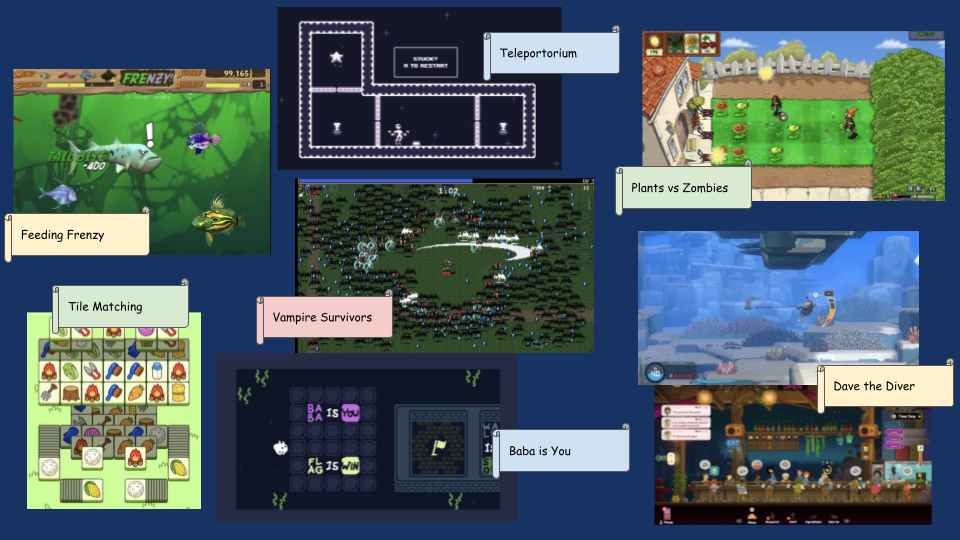
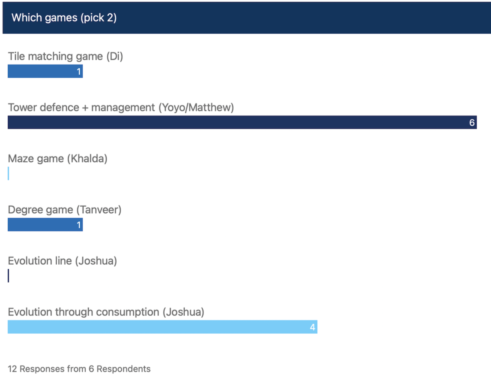
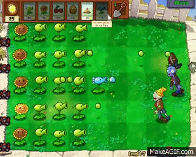
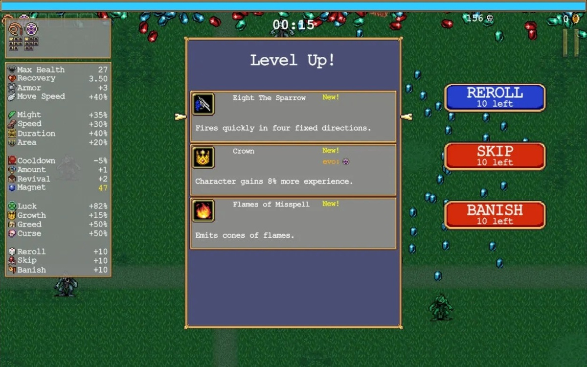
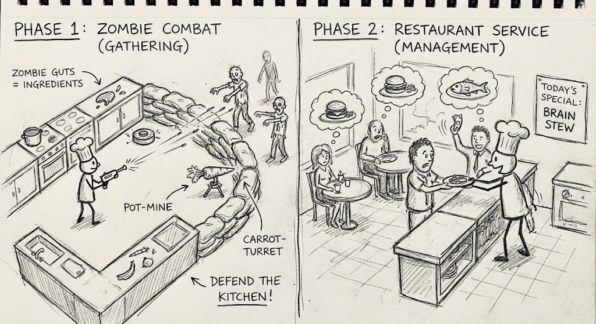
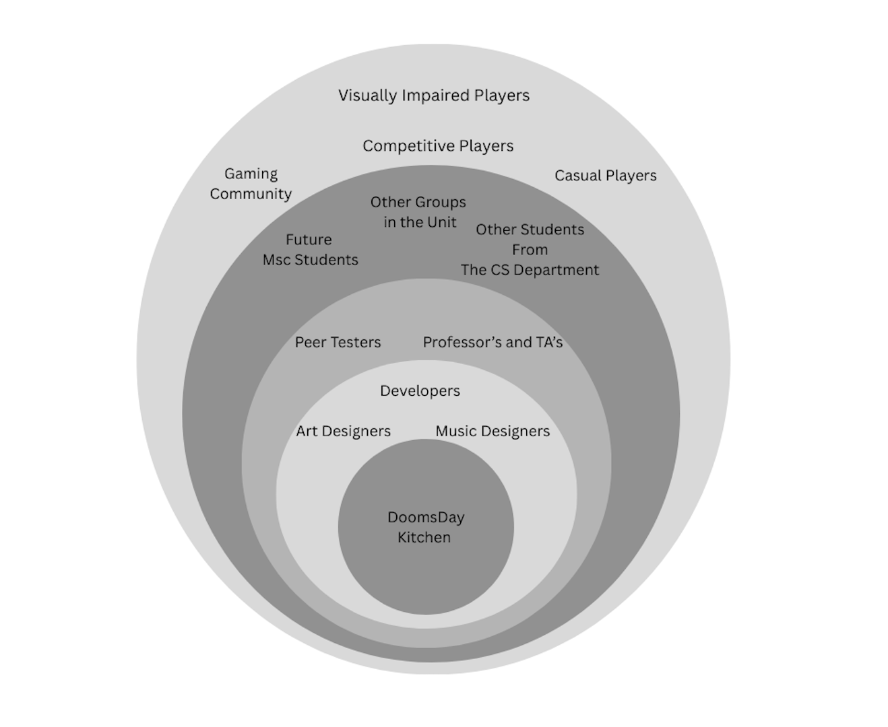
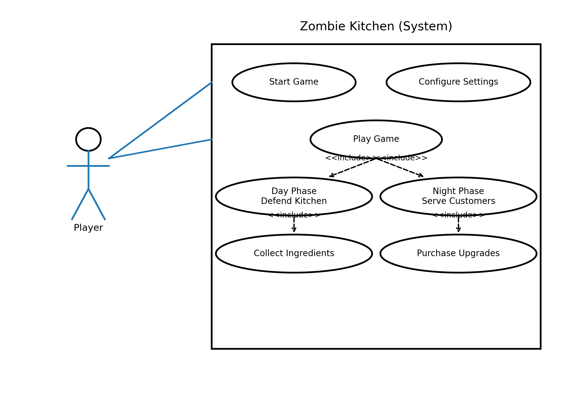

# 2026-group-3
2026 COMSM0166 group 3

# COMSM0166 Project Template
A project template for the Software Engineering Discipline and Practice module (COMSM0166).

## Info

This is the template for your group project repo/report. We'll be setting up your repo and assigning you to it after the group forming activity. You can delete this info section, but please keep the rest of the repo structure intact.

You will be developing your game using [P5.js](https://p5js.org) a javascript library that provides you will all the tools you need to make your game. However, we won't be teaching you javascript, this is a chance for you and your team to learn a (friendly) new language and framework quickly, something you will almost certainly have to do with your summer project and in future. There is a lot of documentation online, you can start with:

- [P5.js tutorials](https://p5js.org/tutorials/) 
- [Coding Train P5.js](https://thecodingtrain.com/tracks/code-programming-with-p5-js) course - go here for enthusiastic video tutorials from Dan Shiffman (recommended!)

## Your Game (change to title of your game)

STRAPLINE. Add an exciting one sentence description of your game here.

IMAGE. Add an image of your game here, keep this updated with a snapshot of your latest development.

LINK. Add a link here to your deployed game, you can also make the image above link to your game if you wish. Your game lives in the [/docs](/docs) folder, and is published using Github pages. 

VIDEO. Include a demo video of your game here (you don't have to wait until the end, you can insert a work in progress video)

## Your Group

GROUP PHOTO. Add a group photo here.

- 1, Matthew Honey, is25252@bristol.ac.uk, role
- 2, Yoyo Wu, xa25891@bristol.ac.uk, role
- 3, Khalda Satti, ji25166@bristol.ac.uk, role
- 4, Tanveer Bakshi, lr25703@bristol.ac.uk, role
- 5, SHUYUAN LIU, de25547@bristol.ac.uk, role
- 6, Di Deng, th25793@bristol.ac.uk, role

## Project Report

## Introduction

- 5% ~250 words 
- Describe your game, what is based on, what makes it novel? (what's the "twist"?)

## 2. Requirements 

### 2.1 Ideation Process

Doomsday Kitchen was a result of continuous brainstorming and developing our ideas in response to feedback from both our team and other student groups. While gathering inspiration, we focused on what we liked and didn’t like about each game’s mechanics, storylines, objectives, themes and player modes (see Figure - below).

Individual members developed their own game ideas, creating drawings, diagrams or character images to illustrate them to the group. Through an anonymous vote, we chose two games:
- **Evolution Through Consumption**
- **Doomsday Kitchen (Tower Defence + Management)**

However, after creating prototypes of both games, we chose the latter for the following reasons:

### Distinctive, Unique Gameplay Concept

Doomsday Kitchen combines multiple game ideas into one concept:
- *Plants vs Zombies* (zombie defence)
- *Vampire Survivors* (upgrades)
- *Dave the Diver* (restaurant management phase)

As opposed to Evolution Through Consumption, which was solely inspired by *Agar.io* and contained less thematic creativity.

### Interactive Menu System for Purchasing Food and Weapons

We adapted the menu of *Dave the Diver* to create our own zombie food items, such as [insert examples]. This increased the customisability and interactivity of the game for the player, encouraging engagement by collecting coins and purchasing items they personally like. This is a key component of our user experience.

### Increased Technical Complexity in Mechanics

Incorporating technical novelty into Doomsday Kitchen was more straightforward than in Evolution Through Consumption. We planned for zombies to move freely within the game map, not restricted to a grid or rows, as in *Plants vs Zombies*, where movement is confined to a straight line. Evolution Through Consumption was more constrained in terms of imaginative mechanical design.

  
   

#### Early stages design

  
   

 Our initial concept was a Tower Defense game inspired by Plants vs. Zombies, featuring the power-scaling and upgrade systems of Vampire Survivors. To create a unique twist, we integrated a management cycle similar to Dave the Diver: the gameplay loops between a combat phase (gathering resources) and a management phase (running a shop/restaurant).

  
   

<b> Core Mechanics & Inspirations: </b>

- Tower Defense: Base defense mechanics inspired by Plants vs. Zombies.

- Progression: Roguelike level-ups and upgrades similar to Vampire Survivors.

- The Twist: A dual-phase loop inspired by Dave the Diver—players switch between an action phase (combat) and a management phase (serving customers).)

  
  
   <b>To simplify development and keep the gameplay flow intuitive, we pivoted from a two-scene structure to a single unified view. 
 
  We simplified the game loop by keeping everything in one persistent scene. The game alternates phases purely through character movement</b>

<table>
  <tr>
    <td width="50%" valign="top">
      <h3>Phase 1: Day Time Defense</h3>
      <ul>
        <li><b>Chef's Position:</b> In front of the counter.</li>
        <li><b>Goal:</b> Defend the kitchen from incoming zombies.</li>
        <li><b>Mechanic:</b> Shooting and gathering ingredients (zombie parts).</li>
        <li><b>UI:</b> Health bar and ammo count are visible.</li>
      </ul>
    </td>
    <td width="50%">
      
    </td>
  </tr>
</table>
<table>
  <tr>
    <td width="50%" valign="top">
      <h3>Phase 2: Night Time Managment</h3>
      <ul>
        <li><b>Chef's Position:</b> Behind the counter.</li>
        <li><b>Goal:</b> Serve customers food to earn gold.</li>
        <li><b>Mechanic:</b> Cooking and Serving.</li>
        <li><b>UI:</b> Ingredients stock and menu are visible.</li>
      </ul>
    </td>
    <td width="50%">
      
    </td>
  </tr>
</table>

### 2.2 Stakeholders & Epics

  

<em>Figure : Onion model showing stakeholders of Doomsday Kitchen</em>

We also identified the following epics based on the requirments of these stakeholders

- Difficulty options
- Accessibility settings
- Able to earn coins/collect meat
- Able to purchase weapons/upgrades
- Clear and readable user interface
- Difficulty scaling
- Good art
- Good music

### User Stories

With these epics and stakeholders, we devised the following user stories which will drive the development of our game:

| Stakeholder | Epic | User Story | Acceptance Criteria|
|-------------|------|------------|--------------------|
| Competitive Player | Difficulty Options | As a competitive player, I want to be challenged so that I can enjoy the game | Given I am on the main menu, when I start a new game, then I should be given the option of a harder difficulty |
| Casual Player | Difficulty Options | As a casual player, I want a more relaxed experience so that I can enjoy the game | Given I am on the main menu, when I start a new game, then I should be given the option of an easier difficulty |
| Visually Impaired Player | Accessibility Settings | As a visually impaired player, I want to be able to increase the UI size so that I can read the interface better | Given I am on the main menu, when I open the settings, then I should be given the option to change the UI size |
| Hard of Hearing Player | Accessibility Settings | As a hard of hearing player, I want the option to increase the audio volume, so that I can hear the game better | Given I am on the main menu, when I open the settings, then I should be given the option to change the audio volume |
| Player | Able to earn coins/collect meat | As a player, I want to be able to collect meat and earn coins, so that I can purchase upgrades | Given I am playing the game, when I beat a day, then I can use all the meat obtained to earn money in the night phase |
| Player | Able to purchase weapons/upgrades | As a player, I want to be able to purchase upgrades, so that I can be stronger as the game gets harder | Given I am playing the game, when I open up the shop menu, Then I can select any weapons/upgrades to purchase with my money |
| Player | Clear and readable user interface | As a player, I want to be able to easily read the user interface | Given I am playing the game, when I look at any part of the UI, the it should be easily readable |
| Player | Clear and readable user interface | As a player, I want to be able to see indicators of my progress so that I can easily understand my progress through the game| Given I am playing the game, when I look at the UI, then I should be able to see: my current money, the current day and the progress through the current day|
| Player | Difficulty Scaling | As a player, I want the difficulty to increase as I progress through the days so that I can feel challenged | Given I have progressed through a few days, when I fight against the approaching zombies, then there should be more of them and their health should be greater |
| Art Designer | Good Art | As an art designer, I want the art to be used properly in the game so that the art is appreciated by the players | Given I am playing the game, when multiple different assets are visible on screen, they should be layered correctly |
| Music Designer | Good Music | As a music designer, I want the music to be properly utilised in the game so that the music is appreciated by the players | Given I am playing the game, when music is played in the game, then it should be used in the correct scenes and have it's volume correctly mixed with the sound effects |

### 2.3 Use Cases

Figure X – Use Case Diagram

- Actor: Player
- System: Zombie Kitchen
- Core Use Cases: Start Game, Configure Settings, Play Game（include Day/Night two stage）, Collect Ingredients, Purchase Upgrades

Table X — Use Case Specifications (Zombie Kitchen)
| Use Case ID | Use Case Name                | Primary Actor | Description                                                 | Preconditions                             | Basic Flow                                                                                                                                  | Alternative / Exception Flow                         | Postconditions                                   |
|-------------|-----------------------------|---------------|-------------------------------------------------------------|-------------------------------------------|---------------------------------------------------------------------------------------------------------------------------------------------|------------------------------------------------------|--------------------------------------------------|
| UC1         | Start Game                  | Player        | Player starts a new game session                            | Game is launched and main menu is visible | 1. Player selects “Start Game”   2. System initialises new run (reset stats, inventory, day)   3. Game transitions to Play Game     | Player exits from menu → Game closes                 | A new run begins                                  |
| UC2         | Configure Settings          | Player        | Player adjusts difficulty and accessibility settings        | Settings menu is accessible               | 1. Player opens settings   2. Selects difficulty   3. Adjusts UI scale or volume   4. Confirms changes                           | Player cancels → no changes saved                    | Settings saved and applied                        |
| UC3         | Play Game                   | Player        | Core gameplay loop alternating between day and night phases | Game session has started                  | 1. System enters Day Phase   2. System enters Night Phase   3. Player may upgrade   4. Day counter increases                     | Player health reaches zero → Game Over               | Player progresses to next day or run ends         |
| UC4         | Day Phase: Defend Kitchen   | Player        | Player fights zombies and survives waves                    | A day begins                              | 1. Zombies spawn   2. Player attacks   3. Zombies defeated   4. Ingredients drop   5. Day ends                                | Player dies → Game Over                              | Ingredients collected; transition to night        |
| UC4.1       | Collect Ingredients         | Player        | Player collects dropped resources                           | Zombie defeated and drop appears          | 1. Ingredient appears   2. Player collects   3. Inventory updates                                                                     | Drop expires or inventory full                       | Inventory increases                               |
| UC5         | Night Phase: Serve Customers| Player        | Player cooks dishes and earns coins                         | Day phase completed                       | 1. Customers appear   2. Player selects dish   3. Ingredients consumed   4. Player serves dish   5. Coins awarded             | No ingredients → cannot serve; customer leaves       | Coins increase                                    |
| UC6         | Purchase Upgrades           | Player        | Player buys upgrades to improve performance                 | Player has coins and shop is open         | 1. Player opens shop   2. Selects upgrade   3. Coins deducted   4. Upgrade applied                                               | Not enough coins → purchase fails                    | Player stats or weapons improved                  |

### 2.4 Reflection

By shaping our epics, user stories and acceptance criteria, we reviewed our proposed game implementations and filled in design gaps. Developing the epics was straightforward, but we became hesitant when creating user stories and acceptance criteria, finding our original definitions too vague. For example, we were sure to include a buying menu, but did not specify what the buying currency in the game was. How would the player purchase upgrades, and how would they earn this currency? We chose that the player would collect zombie meat to earn coins. This lack of detail in our planning reflects our focus on forming good epics but a lack of consideration for the development process.  

The epic, “Difficulty Scaling”, highlighted our lack of lose condition in gameplay. We knew we wanted to gradually increase difficulty as the levels progressed from easy to hard, but we were unsure how to create the challenge. This led to brainstorming ideas: zombies becoming critically close to the player, introducing a “big boss” at the end of a stage with higher difficulty to kill than ordinary zombies and spawning large numbers of zombies to challenge the player’s ability to defeat them before they get too close. We settled on a lose condition where the player’s health decreases as zombies become critically close to the player, and spawning larger numbers of zombies as game level difficulty increases.

Our group also encountered challenges in creating quantifiable acceptance criteria since a significant part of our user stories was based on subjective features. For example, “Given I am playing the game, when multiple different assets are visible on screen, they should be layered correctly”. This user story would be difficult to test because “Good Art” as an epic is subjective. 

Additionally, collecting the requirements emphasised how user stories and acceptance criteria can differ for the same epic. For example, both a casual player and a competitive player might want the option to switch difficulties, but for distinct reasons.

Gathering requirements helped us perfect our game concept, moving us closer to a well-rounded game from a vague idea.

## Design

- 15% ~750 words 
- System architecture. Class diagrams, behavioural diagrams. 

## Implementation

- 15% ~750 words

- Describe implementation of your game, in particular highlighting the TWO areas of *technical challenge* in developing your game. 

## Evaluation

- 15% ~750 words

- One qualitative evaluation (of your choice) 

- One quantitative evaluation (of your choice) 

- Description of how code was tested. 

## Process 

- 15% ~750 words

- Teamwork. How did you work together, what tools and methods did you use? Did you define team roles? Reflection on how you worked together. Be honest, we want to hear about what didn't work as well as what did work, and importantly how your team adapted throughout the project.

## Conclusion

- 10% ~500 words

- Reflect on the project as a whole. Lessons learnt. Reflect on challenges. Future work, describe both immediate next steps for your current game and also what you would potentially do if you had chance to develop a sequel.

## Contribution Statement

- Provide a table of everyone's contribution, which *may* be used to weight individual grades. We expect that the contribution will be split evenly across team-members in most cases. Please let us know as soon as possible if there are any issues with teamwork as soon as they are apparent and we will do our best to help your team work harmoniously together.

## Additional Marks

You can delete this section in your own repo, it's just here for information. in addition to the marks above, we will be marking you on the following two points:

- **Quality** of report writing, presentation, use of figures and visual material (5% of report grade) 
  - Please write in a clear concise manner suitable for an interested layperson. Write as if this repo was publicly available.
- **Documentation** of code (5% of report grade)
  - Organise your code so that it could easily be picked up by another team in the future and developed further.
  - Is your repo clearly organised? Is code well commented throughout?
