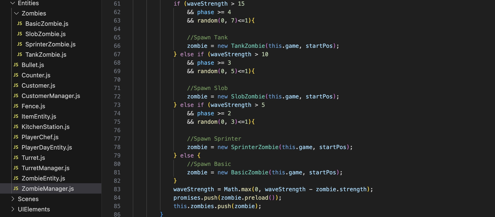
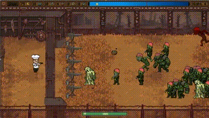
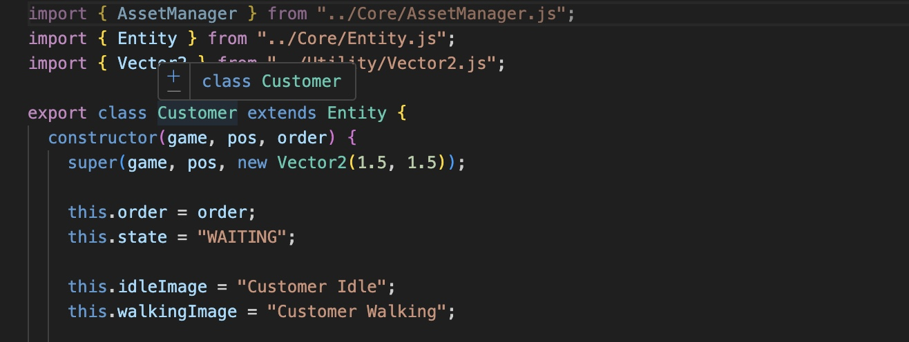
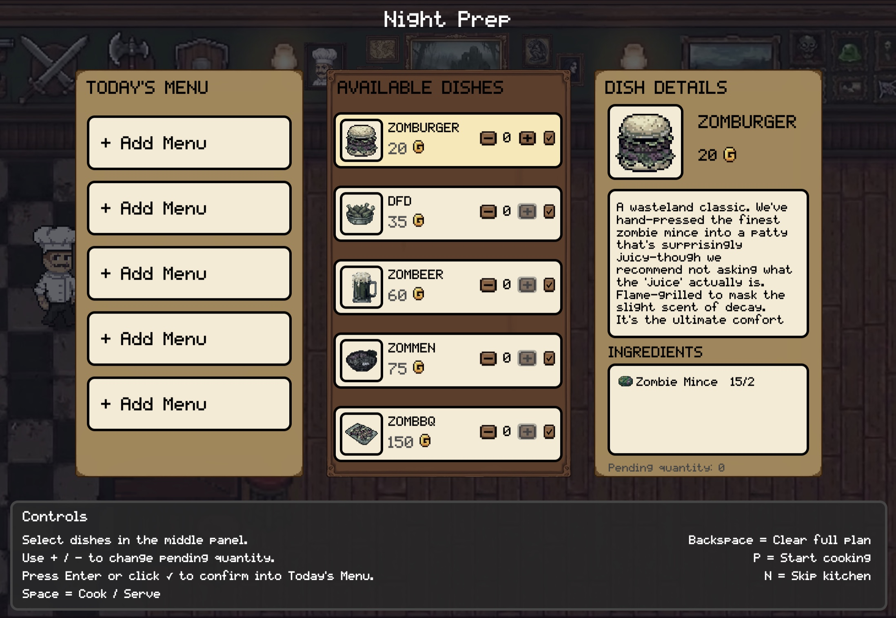
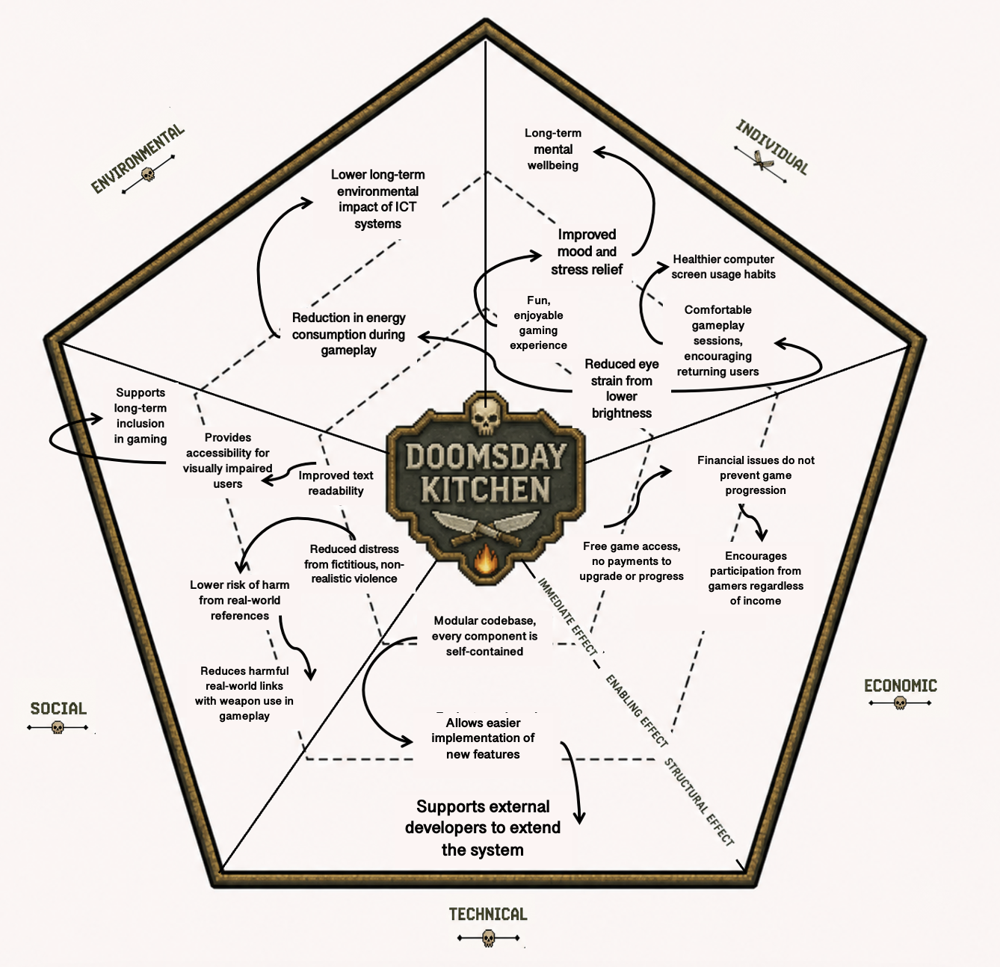
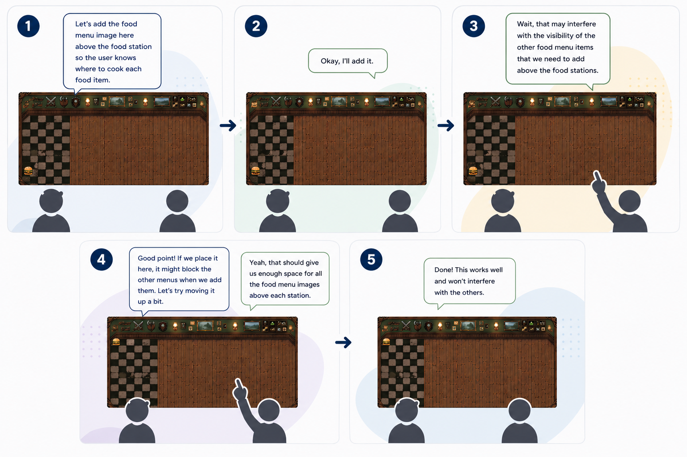

# 2026-group-3
2026 COMSM0166 group 3

## Doomsday Kitchen

  <h3><i>Shoot, Cook, Survive. A post-apocalyptic culinary defence game.</i></h3>

  

    
  🧟‍♂️  <a href="https://uob-comsm0166.github.io/2026-group-3/"><b>CLICK HERE TO PLAY</b></a> 🍴

   
  
  
   

  🎥  <a href="https://youtu.be/Si7i7T8xywY"><b>Demo Video</b></a> 🎮

 

## Our Group

 

| Name | Email | Role |
| :---: | :--- | :--- |
| Matthew Honey | is25252@bristol.ac.uk | Project Manager, Front-end Developer, QA, Music/SFX |
| Yoyo Wu | xa25891@bristol.ac.uk | Front-end Developer, UX/UI Design, Game Flow, Video |
| Khalda Satti | ji25166@bristol.ac.uk | Project Manager, Front-end Developer, QA, Music/SFX |
| Tanveer Bakshi | lr25703@bristol.ac.uk | Documentation, Developer,Game Flow |
| Shuyuan Liu | de25547@bristol.ac.uk | Developer, Architecture and Integration |
| Di Deng | th25793@bristol.ac.uk | Documentation, Developer,Github Review |

  

# Project Report

## Contents

- [1. Introduction](#1-introduction)
- [2. Requirements](#2-requirements)
  - [2.1 Ideation Process](#21-ideation-process)
  - [2.2 Stakeholders & Epics](#22-stakeholders--epics)
  - [2.3 Use Cases](#23-use-cases)
  - [2.4 Reflection](#24-reflection)
- [3. Design](#3-design)
  - [3.1 Class Diagrams](#31-class-diagrams)
  - [3.2 Behavioural Diagrams](#32-behavioural-diagrams)
- [4. Implementation](#4-implementation)
  - [4.1 Shooting Scene Challenge: Managing a large number of game entities in the shooting scene](#41-shooting-scene-challenge-managing-a-large-number-of-game-entities-in-the-shooting-scene)
  - [4.2 Kitchen Scene Challenge: Changing the Kitchen from Order-Following to Planning-Based Gameplay](#42-kitchen-scene-challenge-changing-the-kitchen-from-order-following-to-planning-based-gameplay)
- [5. Evaluation](#5-evaluation)
  - [Qualitative Evaluation](#qualitative-evaluation)
  - [Heuristic Evaluation](#heuristic-evaluation)
  - [Quantitative Evaluation: NASA Task Load Index (TLX)](#quantitative-evaluation-nasa-task-load-index-tlx)
  - [Methods](#methods)
  - [Results](#results)
  - [Black Box Testing](#black-box-testing)
- [6. Sustainability](#6-sustainability)
- [7. Process](#7-process)
  - [Planning Poker](#planning-poker)
  - [Kanban](#kanban)
  - [Communication: WhatsApp and Google Meet](#communication-whatsapp-and-google-meet)
  - [Pair Programming](#pair-programming)
- [8. Conclusion](#8-conclusion)
- [9. Contribution Statement](#9-contribution-statement)
- [10. References](#10-references)

## 1. Introduction

Doomsday Kitchen is a genre-blending 2D survival game set in a post-apocalyptic world, forty years after a catastrophic global famine known as the "Shamble Shift." Players take on the role of "The Chef," inheriting a legendary wasteland restaurant from his father. To keep the colony from starving, the player must engage in a dual-phase gameplay loop that seamlessly transitions between high-octane action and strategic time management.

Our core mechanics draw heavy inspiration from several successful titles. The combat and survival aspects are influenced by the horde-clearing upgrade systems of Vampire Survivors and the iconic zombie defence themes of Plants vs. Zombies. Meanwhile, the resource management and restaurant operation phases are directly inspired by the dual-gameplay loop of Dave the Diver, where combat gathering fuels the business operations.

What makes Doomsday Kitchen novel is its subversion of player expectations. At first glance, players may assume it is a straightforward top-down shooter focused purely on surviving endless waves of enemies. However, the game's true "twist" is revealed when the player transitions into the management phase: the enemies they were just shooting are actually the raw ingredients for their restaurant. This unhinged, dark-comedy element of harvesting, cooking, and serving zombie meat to hungry wasteland survivors adds a unique thematic layer. It transforms standard enemy loot into a crucial economic resource, forcing players to balance aggressive hunting with careful culinary planning.

## 2. Requirements 

### 2.1 Ideation Process

Doomsday Kitchen was a result of continuous brainstorming and developing our ideas in response to feedback from both our team and other student groups. While gathering inspiration, we focused on what we liked and didn’t like about each game’s mechanics, storylines, objectives, themes and player modes.

Individual members developed their own game ideas, creating drawings, diagrams or character images to illustrate them to the group. Through an anonymous vote, we chose two games:
- **Evolution Through Consumption**
- **Doomsday Kitchen (Tower Defence + Management)**

However, after creating prototypes of both games, we chose the latter for the following reasons:

### Distinctive, Unique Gameplay Concept

Doomsday Kitchen combines multiple game ideas into one concept:
- *Plants vs Zombies* (zombie defence)
- *Vampire Survivors* (upgrades)
- *Dave the Diver* (restaurant management phase)

As opposed to Evolution Through Consumption, which was solely inspired by *Agar.io* and contained less thematic creativity.

### Interactive Menu System for Purchasing Food and Weapons

We adapted the menu of *Dave the Diver* to create our own zombie food items, such as Zomburgers or Zombbq. This increased the customisability and interactivity of the game for the player, encouraging engagement by collecting coins and purchasing items they personally like. This is a key component of our user experience.

### Increased Technical Complexity in Mechanics

Incorporating technical novelty into Doomsday Kitchen was more straightforward than in Evolution Through Consumption. We planned for zombies to move freely within the game map, not restricted to a grid or rows, as in *Plants vs Zombies*, where movement is confined to a straight line. Evolution Through Consumption was more constrained in terms of imaginative mechanical design.

  
   

#### Early stages design

  
   

 Our initial concept was a Tower Defence game inspired by Plants vs. Zombies, featuring the power-scaling and upgrade systems of Vampire Survivors. To create a unique twist, we integrated a management cycle similar to Dave the Diver: the gameplay loops between a combat phase (gathering resources) and a management phase (running a shop/restaurant).

  
   

<b> Core Mechanics & Inspirations: </b>

- Tower Defence: Base defence mechanics inspired by Plants vs. Zombies.

- Progression: Roguelike level-ups and upgrades similar to Vampire Survivors.

- The Twist: A dual-phase loop inspired by Dave the Diver—players switch between an action phase (combat) and a management phase (serving customers).

  
  
   <b>To simplify development and keep the gameplay flow intuitive, we pivoted from a two-scene structure to a single unified view. 
 
  We simplified the game loop by keeping everything in one persistent scene. The game alternates phases purely through character movement</b>

<table>
  <tr>
    <td width="50%" valign="top">
      <h3>Phase 1: Day Time Defence</h3>
      <ul>
        <li><b>Chef's Position:</b> In front of the counter.</li>
        <li><b>Goal:</b> Defend the kitchen from incoming zombies.</li>
        <li><b>Mechanic:</b> Shooting and gathering ingredients (zombie parts).</li>
        <li><b>UI:</b> Health bar and ammo count are visible.</li>
      </ul>
    </td>
    <td width="50%">
      
    </td>
  </tr>
</table>
<table>
  <tr>
    <td width="50%" valign="top">
      <h3>Phase 2: Night Time Management</h3>
      <ul>
        <li><b>Chef's Position:</b> Behind the counter.</li>
        <li><b>Goal:</b> Serve customers food to earn gold.</li>
        <li><b>Mechanic:</b> Cooking and Serving.</li>
        <li><b>UI:</b> Ingredients stock and menu are visible.</li>
      </ul>
    </td>
    <td width="50%">
      
    </td>
  </tr>
</table>

### 2.2 Stakeholders & Epics

  

<em>Onion model showing stakeholders of Doomsday Kitchen</em>

We also identified the following epics based on the requirements of these stakeholders

- Difficulty options
- Accessibility settings
- Able to earn coins/collect meat
- Able to purchase weapons/upgrades
- Clear and readable user interface
- Difficulty scaling
- Good art
- Good music

### User Stories

With these epics and stakeholders, we devised the following user stories which will drive the development of our game:

| Stakeholder | Epic | User Story | Acceptance Criteria|
|-------------|------|------------|--------------------|
| Competitive Player | Difficulty Options | As a competitive player, I want to be challenged so that I can enjoy the game | Given I am on the main menu, when I start a new game, then I should be given the option of a harder difficulty |
| Casual Player | Difficulty Options | As a casual player, I want a more relaxed experience so that I can enjoy the game | Given I am on the main menu, when I start a new game, then I should be given the option of an easier difficulty |
| Visually Impaired Player | Accessibility Settings | As a visually impaired player, I want to be able to increase the UI size so that I can read the interface better | Given I am on the main menu, when I open the settings, then I should be given the option to change the UI size |
| Hard of Hearing Player | Accessibility Settings | As a hard of hearing player, I want the option to increase the audio volume, so that I can hear the game better | Given I am on the main menu, when I open the settings, then I should be given the option to change the audio volume |
| Player | Able to earn coins/collect meat | As a player, I want to be able to collect meat and earn coins, so that I can purchase upgrades | Given I am playing the game, when I beat a day, then I can use all the meat obtained to earn money in the night phase |
| Player | Able to purchase weapons/upgrades | As a player, I want to be able to purchase upgrades, so that I can be stronger as the game gets harder | Given I am playing the game, when I open up the shop menu, Then I can select any weapons/upgrades to purchase with my money |
| Player | Clear and readable user interface | As a player, I want to be able to easily read the user interface | Given I am playing the game, when I look at any part of the UI, the it should be easily readable |
| Player | Clear and readable user interface | As a player, I want to be able to see indicators of my progress so that I can easily understand my progress through the game| Given I am playing the game, when I look at the UI, then I should be able to see: my current money, the current day and the progress through the current day|
| Player | Difficulty Scaling | As a player, I want the difficulty to increase as I progress through the days so that I can feel challenged | Given I have progressed through a few days, when I fight against the approaching zombies, then there should be more of them and their health should be greater |
| Art Designer | Good Art | As an art designer, I want the art to be used properly in the game so that the art is appreciated by the players | Given I am playing the game, when multiple different assets are visible on screen, they should be layered correctly |
| Music Designer | Good Music | As a music designer, I want the music to be properly utilised in the game so that the music is appreciated by the players | Given I am playing the game, when music is played in the game, then it should be used in the correct scenes and have it's volume correctly mixed with the sound effects |

### 2.3 Use Cases

  

 <em>Use Case Diagram</em>

- Actor: Player
- System: Zombie Kitchen
- Core Use Cases: Start Game, Configure Settings, Play Game（include Day/Night two stage）, Collect Ingredients, Purchase Upgrades

| Use Case ID | Use Case Name | Primary Actor | Description | Preconditions | Trigger | Main Flow (Summary) | Postconditions | Alternatives / Exceptions |
|------------|-------------|--------------|------------|--------------|--------|--------------------|---------------|--------------------------|
| UC1 | Start Game | Player | Start a new gameplay run | Game launched; main menu visible | Player selects Start Game | System initializes run and enters gameplay loop | New run active | Loading failure returns to menu |
| UC2 | Configure Settings | Player | Adjust game preferences | Player in menu | Player opens settings | System displays and saves updated preferences | Settings updated | Invalid input rejected |
| UC3 | Play Game | Player | Progress through day–night cycles | Run has started | Gameplay begins | Day phase → Night phase → repeat | Player progresses or run ends | Pause, Quit, or Game Over |
| UC4 | Day Phase – Defend Kitchen | Player | Protect kitchen from zombie waves | Play Game active | Day phase starts | Zombies spawn → Player defends → Ingredients drop | Resources gained | Kitchen destroyed → Game Over |
| UC5 | Defeat Zombie Wave | Player | Eliminate attacking zombies | Zombie wave active | Zombies appear | Player attacks → Zombies removed → Drops generated | Wave cleared | Player overwhelmed → Game Over |
| UC6 | Gather Ingredients | Player | Collect dropped ingredients | Ingredients in scene | Player collects item | Item picked up → Inventory updated | Ingredients stored | Inventory full prevents pickup |
| UC7 | Night Phase – Run Kitchen | Player | Convert ingredients into coins/upgrades | Day phase completed | Night phase starts | Cook → Serve → Earn coins → Upgrade | Upgrades applied | None |
| UC8 | Cook Dishes | Player | Prepare dishes from ingredients | Ingredients available | Player selects recipe | Ingredients consumed → Dish created | Dish ready | Missing ingredients |
| UC9 | Serve Customers | Player | Fulfil orders for coins | Customers present | Order placed | Dish served → Coins rewarded | Coins earned | Wrong dish or timeout penalty |
| UC10 | Pause Game | Player | Temporarily halt gameplay | Play Game active | Player pauses | Game freezes → Pause menu shown | Game resumes | None |
| UC11 | Quit Game | Player | Exit current run | Play Game active | Player selects quit | Confirmation → Run ends | Main menu shown | Quit cancelled |
| UC12 | Game Over | Player | End run after failure | Failure met | Kitchen destroyed | Game stops → Game Over screen | Post-game options | None |
| UC13 | Purchase Upgrades | Player | Improve abilities | Sufficient coins | Player opens upgrade menu | Upgrade applied → Coins deducted | Ability improved | Insufficient coins |
| UC14 | Post-Game Options | Player | Choose next action | Game Over active | Player selects option | Action executed | New run or menu | Invalid selection retry |

 <em>Table： Use Case Specifications (Doomsday Kitchen)</em>

### 2.4 Reflection

By shaping our epics, user stories and acceptance criteria, we reviewed our proposed game implementations and filled in design gaps. Developing the epics was straightforward, but we became hesitant when creating user stories and acceptance criteria, finding our original definitions too vague. For example, we were sure to include a buying menu, but did not specify what the buying currency in the game was. How would the player purchase upgrades, and how would they earn this currency? We chose that the player would collect zombie meat to earn coins. This lack of detail in our planning reflects our focus on forming good epics but a lack of consideration for the development process.  

The epic, “Difficulty Scaling”, highlighted our lack of lose condition in gameplay. We knew we wanted to gradually increase difficulty as the levels progressed from easy to hard, but we were unsure how to create the challenge. This led to brainstorming ideas: zombies becoming critically close to the player, introducing a “big boss” at the end of a stage with higher difficulty to kill than ordinary zombies and spawning large numbers of zombies to challenge the player’s ability to defeat them before they get too close. We settled on a lose condition where the player’s health decreases as zombies become critically close to the player, and spawning larger numbers of zombies as game level difficulty increases.

Our group also encountered challenges in creating quantifiable acceptance criteria since a significant part of our user stories was based on subjective features. For example, “Given I am playing the game, when multiple different assets are visible on screen, they should be layered correctly”. This user story would be difficult to test because “Good Art” as an epic is subjective. 

Additionally, collecting the requirements emphasised how user stories and acceptance criteria can differ for the same epic. For example, both a casual player and a competitive player might want the option to switch difficulties, but for distinct reasons.

## 3 Design

With our requirements laid out, we could begin working on the architecture design, including any class or sequence diagrams required. We decided an object oriented approach would be most suitable and determined a few key design points we wanted to build our architecture around

1. We would need a way to dynamically switch between scenes within the game. To do this, we decided to use a scene object that could be dynamically switched out within the operation of the game. 
2. We would need a way to contain all the current game elements. To do this, we chose to classify all elements as either entities or UI elements. 
3. We would need a way to dynamically scale the game and it's elements with the players screen. To do this, we chose to fix all entities onto a 16 by 9, and map those local coordinates onto the screen. For UI elements, we don't want them changing size with the screen size, so we decided they would be in fixed positions on the screen, using parameters to attach them to parts of the screen
4. We would need a way to update and draw the game each frame. To do this, we chose to use a model-view-controller approach, whereby the controller updates everything in the scene first, including all its elements, before the view draws everything in the scene.

### 3.1 Class diagrams 

From our system architecture, we designed 3 class diagrams. The first is for the core system architecture, representing our model-view-controller system. The 2nd and 3rd represent our 2 main scenes within the game; our kitchen scene and our shooter scene. We determined these were the most important scenes to design, and although other scenes exist like a main menu scene or a introduction scene, those had a relatively simple design.

#### MVC Class Diagram

Game.js is the core of our MVC architecture, holding the model, view, controller and the extra sound and asset managers. Controller.js handles any incoming events from app and View.js handles any window resizing and canvas drawing. Model.js holds any game data as well as the current game state. The idea is that any data that should be preserved between scenes should be held within the Model, while any local data for the scene should be held within that scene. The scene holds two arrays, one for all the entities, and one for all the UI elements. In addition, there are some generic UI elements such as buttons and labels which can be used across all scenes.

#### Shooter Scene Class Diagram

The shooter scene uses three managers to control its turrets, weapons and zombies. It has UI elements the UIBar and the shop menu, and has a range of entities that are the player, zombies, bullets, turrets and fence.

#### Kitchen Scene Class Diagram

The kitchen scene has a production manager that interacts with the menu data and the task list to generate orders from the 5 available production tasks. It's entities are the player, customers, counter and kitchen stations, while sharing the same UIbar with the shooter scene

#### UI Bar Class Diagram

The UI bar is a UI element the includes a number of buttons and labels, as well as the phase progression bar which expands to fit the remaining space within the UI bar.

### 3.2 Behavioural Diagrams

From our architecture, we determined the most import interactions would come from the update and draw loops as well as any other interactions within our MVC architecture. To map out these interactions, we designed a sequence diagram that contained these various interactions within the system.

The update loop propagates from the App to the controller, where it collects all events gathered over that frame from any onInput events. These are then sent to the model, which is sent to the current scene, which is then sent to each entity and UI element.

The draw loop propagates from the app to the view, where it clears the canvas. It the propagates to the model, then the current scene and then all the entities and UI elements.

## 4. Implementation

From an overall implementation perspective, our game was not designed around a single gameplay mode. Instead, it was divided into two main parts: the shooting section and the kitchen section. These two sections worked in very different ways. The shooting scene required the game to create and control many entities with different behaviours, sprites and interactions, while the kitchen scene required the player to plan dishes, use ingredients, cook food and sell the finished dishes.

Because of this, putting all the logic into one large file would have made the code hard to maintain and difficult for the team to develop together. Therefore, we used the Game class as the central structure to connect the Model, `View`, `Controller`, `AssetManager` and `SoundManager`. Each stage of the game was then handled by a separate Scene class.

This structure made the project more modular, made it easier to add or change scenes, and allowed team members to work on different parts of the game more independently. It also provides the basis for the two implementation challenges discussed below: managing many different entities in the shooting scene, and changing the kitchen scene from an order-following system into a planning-based gameplay system.

### 4.1 Shooting Scene Challenge: Managing a large number of game entities in the shooting scene

One of the major implementation challenge was the shooting scene, which required us to create and control a large number of entities with different behaviours, sprites and interactions. Unlike the kitchen scene, which mainly focuses on player movement, stations and UI interaction, the shooting scene contains many dynamic objects at the same time, such as `Zombies`, `Turret`, `Bullet` and collectible items. If each object had been handled with separate hard-coded logic, the scene would have quickly become difficult to extend and debug. Therefore, the implementation needed an entity-based structure where each object could store its own state and behaviour while still being updated and rendered consistently by the scene. This made it possible to spawn multiple `Zombies`, manage their movement, handle attacks or collisions, and display the correct sprite for each object without duplicating the same logic throughout the code.

  

 <em>How to manage different types of zombies</em>

  

 <em>Shooting Scene Demo</em>

### 4.2 Kitchen Scene Challenge: Changing the Kitchen from Order-Following to Planning-Based Gameplay

One major challenge in the kitchen part was redesigning the gameplay logic from an order-following system into a planning-based system. This was difficult because the change affected several connected systems at the same time, including inventory, recipes, cooking, selling, and rewards. The most notable change was that we reduced the role of `Customer` orders and introduced a `TaskList`, allowing the player to actively plan what to produce instead of simply reacting to `Customer` requests. Ingredients collected from zombies are stored in the inventory, and the player can choose which dishes to cook based on the available resources. These dishes can then be sold for coins, which connects the kitchen more clearly to the wider game loop. Therefore, the challenge was not just adding a new feature, but making sure that the whole kitchen gameplay loop worked consistently.

  

 <em>Figure: Reduced customer-driven logic in the redesigned kitchen system</em>

  

 <em>Kitchen Scene Tasklist</em>

## 5. Evaluation
## Qualitative Evaluation

## Heuristic Evaluation

We conducted a heuristic evaluation of the game using Nielsen's 10 usability heuristics. Each issue was identified and rated based on severity calculated from frequency, impact, and persistence.

Severity = (Frequency + Impact + Persistence) / 3

| # | Heuristic | Location | Problem | F | I | P | Severity | Evidence | Fix |
|---|-----------|----------|---------|---|---|---|----------|----------|-----|
| 1 | Visibility of System Status | Night | Player didn't know when day/night changes | 3 | 3 | 2 | 2.67 | Sudden phase switch | Show transition message |
| 2 | Error Prevention | Day | Incorrect ingredient mapping blocks cooking | 4 | 4 | 4 | 4.00 | Meat mismatch | Fix mapping |
| 3 | Visibility of System Status | Night | No feedback when meat is collected | 3 | 3 | 3 | 3.00 | No drop indicator | Add animation/UI feedback |
| 4 | Consistency & Standards | Day | Different controls between phases | 2 | 2 | 2 | 2.00 | Control mismatch | Standardize controls |
| 5 | Recognition vs Recall | Day | No recipe visibility forces memory use | 3 | 3 | 4 | 3.33 | No recipe list | Add recipe panel |
| 6 | Flexibility & Efficiency | Both | Limited gameplay strategies | 3 | 2 | 4 | 3.00 | Same loop every round | Add upgrades/waves |
| 7 | Help & Documentation | Both | No tutorial for new players | 4 | 3 | 4 | 3.67 | Players confused | Add Instructions menu |
| 8 | Aesthetic & Minimalist Design | Day | UI clutter and small text | 3 | 2 | 3 | 2.67 | Too much info | Simplify UI |
| 9 | Visibility of System Status | Night | No wall damage feedback | 3 | 3 | 3 | 3.00 | No damage indicator | Add cracking effect |
| 10 | User Control & Freedom | Global | No pause functionality | 3 | 4 | 4 | 3.67 | Cannot pause | Add pause menu |
| 11 | Flexibility & Efficiency | Night | Turret position unclear | 2 | 2 | 3 | 2.33 |Can be placed in only one area| Show turret stats |
| 12 | Visibility of System Status | Night | Meat drops not clearly visible | 3 | 3 | 3 | 3.00 | Loot unclear | Add visible drops |

Based on the findings, several targeted design improvements were recommended:

- Implemented an Instructions menu to support first-time users and improve learnability
- Introduced a pause menu to enhance user control and improve user experience
- Improved system feedback mechanisms: Addition of features like meat drops, wall damage, phase transitions
- Ensured consistency in ingredient mapping and controls
- Added recipe panel and reduce UI clutter
- Introduced upgrades and varied gameplay strategies

## Quantitative Evaluation: NASA Task Load Index (TLX)

## Methods

We administered the NASA Task Load Index (Hart and Staveland, 1988) to measure users’ perceived workload across two difficulty levels: Easy and Hard. The latter contained a higher spawn frequency of zombies. To reduce between-participant differences, a within-subjects design was adopted and we recruited only students. 

## Results

### Stacked Radar Chart: Aggregate perceived workload score (n = 10) for Easy and Hard difficulty

  

---

### Radar Chart (Easy Difficulty): Aggregate perceived workload score (n = 10), per dimension

<table>
  <tr>
    <td align="center">
      <strong>Radar Chart (Easy Difficulty)</strong> 
      Aggregate perceived workload score (n = 10), per dimension  
      
    </td>
    <td align="center">
      <strong>Radar Chart (Hard Difficulty)</strong> 
      Aggregate perceived workload score (n = 10), per dimension  
      
    </td>
  </tr>
</table>

### Bar Chart: NASA Task Load Index (TLX)

  

## Wilcoxon Signed-Rank Test Results (NASA-TLX)

| Dimension     | W stat | p-value | Significant (p < 0.05) | Result        |
|---------------|--------|---------|--------------------------|---------------|
| Mental        | 0      | 0.005   | ✔                        | Significant   |
| Physical      | 0      | 0.025   | ✔                        | Significant   |
| Temporal      | 0      | 0.010   | ✔                        | Significant   |
| Performance   | —      | —       | ✘                        | Not significant |
| Effort        | 3.5    | 0.010   | ✔                        | Significant   |
| Frustration   | 10.5   | 0.100   | ✘                        | Not significant |

---

Most dimensions produced a statistically significant result, showing that perceived workload increased across easy and hard conditions. Our difficulty levels were clearly different to most players.

Mental demand was significantly higher in the hard condition. This is likely due to the increase in zombie spawn frequency. Players may have perceived pressure to multi-task and move quickly across the screen to defeat the zombies before they became too close. This potentially challenged the user's attentional resources, and pairing this with the non-significant result in performance, is consistent with research that increasing “enemies” can reduce perceived game performance and increase cognitive workload (Allison and Polich, 2009).

Temporal and effort scores were moderately higher in the hard condition, indicating players felt under time pressure and exerted more effort to achieve their score. We assume that players perceived an increase in time pressure in attempts to defeat the zombies before their health dropped, and an overall higher task complexity. This is in line with gaming studies that use the NASA-TLX, which indicate higher cognitive load when players are under time constraints to move quickly (Sevcenko et al., 2021).

Interestingly, frustration had an insignificant result, with unusual variability in scores. For example, User 7 reported less frustration and effort for the hard condition, despite rating increased mental demand. User 1 also recorded less frustration in the harder condition, despite rating mental, physical and temporal demand as higher.

This could be attributed to differences in participants’ perception of the game feedback, specifically the health bar, which very gradually decreased from 100% during gameplay. Participants may not have perceived this as impactful enough to feel frustrated. Rather than omitting these values as possible outliers, we included them in our evaluation, linking them to individual differences.

Limitation: Learning effects potentially minimised perceived workload differences in the Hard difficulty. On reflection, the conditions could have been counterbalanced or randomised across participants, or possibly a time gap to reduce these biases. Nonetheless, the results show that workload predictably increased between the Easy and Hard difficulty levels.

## Black Box Testing

Testing was performed by simulating real player behaviour and verifying that all game systems respond correctly to user interactions. Each feature was tested across different game states (day and night phases) to ensure consistent and expected behaviour without examining the underlying code.

### Day/Night Transition

| Test Case | Input | Expected Output | Result |
|-----------|-------|-----------------|--------|
| TC1 | Wait for day timer to end | Transition to night phase with visual/audio feedback | ✓ Pass |
| TC2 | Wait for night timer to end | Transition to day phase with message | ✓ Pass |
| TC3 | Check UI during transition | Phase indicator updates correctly | ✓ Pass |

### Ingredient Collection (Night Phase)

| Test Case | Input | Expected Output | Result |
|-----------|-------|-----------------|--------|
| TC1 | Enemy defeated during night | Meat drops at enemy location | ✓ Pass |
| TC2 | Meat dropped floats to the Items bar | Ingredient count increases | ✓ Pass |

### Recipe System (Day Phase)

| Test Case | Input | Expected Output | Result |
|-----------|-------|-----------------|--------|
| 1 | Player has correct ingredients | Recipe can be cooked | ✓ Pass |
| 2 | Player missing ingredients | Players tries to add a dish is given a "not enough Ingredients message" | ✓ Pass |
| 3 | Complete recipe | Ingredients consumed,Player earns Profit | ✓ Pass |

### Enemy Spawning (Night Phase)

| Test Case | Input | Expected Output | Result |
|-----------|-------|-----------------|--------|
| 1 | Night phase begins | Enemies spawn at random locations | ✓ Pass |
| 2 | Enemy defeated | Enemy disappears, meat drops | ✓ Pass |
| 3 | Multiple waves | Enemy count increases each wave | ✓ Pass |

### Wall Defence

| Test Case | Input | Expected Output | Result |
|-----------|-------|-----------------|--------|
| 1 | Enemy attacks wall | Wall health decreases | ✓ Pass |
| 2 | Wall takes damage | Visual damage indicator shows | ✓ Pass |
| 3 | Wall health = 0 | Game over/loss state triggered | ✓ Pass |

### Shop Menu

| Test Case | Input | Expected Output | Result |
|-----------|-------|-----------------|--------|
| 1 | Press shop menu  |  menu appears | ✓ Pass |
| 2 | You buy weapons| weapon changes | ✓ Pass |
| 3 | buy turrets | can place a turret in the shooter scene | ✓ Pass |

### Controls Consistency

| Test Case | Input | Expected Output | Result |
|-----------|-------|-----------------|--------|
| 1 | Controls work in day phase | Player can move/interact | ✓ Pass |
| 2 | Controls work in night phase | Player can move/defend | ✓ Pass |
| 3 | Key bindings are consistent | Same keys work throughout game | ✓ Pass |

# 6. Sustainability
It is important to consider the sustainability impact of our systems across all dimensions beyond its immediate effects (enabling and structural), as through our design we cause change, and shape our environment (Becker et al., 2015).  

Our team conducted a sustainability impact analysis with the Sustainability Analysis Framework. We identified user stories for each dimension. 

| Sustainability Dimension | User Story | Acceptance Criteria |
|-------------------------|------------|---------------------|
| Individual |  As a player, I want Doomsday Kitchen to have a pause menu, so I can break the continuous, addictive game loop and take a break. | Given I am playing a level, when I open the pause menu, then Doomsday Kitchen should immediately stop and provide an option to exit. |
|  | As a player, I want a brightness slider, so I can reduce my eye strain while playing. | Given I am on the settings menu, when I adjust the brightness, then the brightness should immediately update to the selected value. |
| Social | As a visually-impaired player, I want to increase text size, so I can read text comfortably. | Given I am on the settings menu, when I increase the text size, then all the UI text should increase proportionally and remain readable for the game session. |
|  | As a hearing-impaired player, I want to control both the sound effects and music volume, so that I can adjust the audio levels to suit my hearing needs. | Given I am on the settings menu, when I increase or decrease the music or sound effects volume, then they should update seperately |
|  | As a player, I want Doomsday Kitchen phases to use fictional elements, so violent, combat themes (like weaponery) feel more light-hearted and less realistic . | Given I am playing the game, when I enter the shooter or kitchen phase, then I should see characters and assets presented in a non-realistic style. |
| Environmental | As an environmentally-aware player, I want to be able to exit Doomsday Kitchen's loop at any time, so I can minimise unnecessary energy use. | Given I am playing Doomsday Kitchen, when I choose to exit the level, then it should stop the game and return me to the main page. |
| Technical | As a developer, I want Doomsday Kitchen code to be modular, so it is easier to maintain and update components. | Given the Doomsday Kitchen codebase, when I want to add new features, then they should not require significant changes to other components designs. |
| Economic | As a player, I want to progress through levels in Doomsday Kitchen without needing to pay for key features, so I am not limited by my finances.  | Given I access Doomsday Kitchen, when I progress through levels, I should not be asked to make payments to continue. |

#### Individual Impact

Doomsday Kitchen may positively impact a user’s mental health by providing stress relief and a sense of accomplishment after each level/day survived. Research suggests that gaming can reduce stress and improve mood (Vuorre et al., 2024), supporting the potential benefits of games as a leisure activity.

On the other hand, if users become overly engaged, the repetitive gameplay loop of “shooting scene → kitchen scene” may encourage an addictive engagement. As game "days" are relatively short and slightly increase in difficulty, this could enable prolonged sessions.

 In attempts to mitigate this, Doomsday Kitchen avoids long-term progression features such as player leaderboards, to reduce competition between players. This could reduce the pressure for users to return, continue their progress and return to the continuous loop. In addition, we implemented a pause menu to allow players to halt gameplay and prevent playing for extended amounts of time. User privacy is protected and preserved as users do not provide their names for leaderboard information.

In the future, we could further mitigate this by isolating the game sessions into levels that users must unlock and enter themselves, rather than automatically starting the next one, similar to popular games like Candy Crush. This way, players would have defined stopping points in sessions, encouraging them to
choose to stop.

Physical health is also at a small risk, as extended sessions could contribute to eye strain; therefore, a brightness slider has been implemented to improve visual comfort.

Users are given agency through opportunities to upgrade and customise, particularly in weapon selection and innovative kitchen menu items. However, at the same time, this is constrained by the number of coins earned in the kitchen scene and zombie drops collected in the shooter scene. This pushes players to plan ahead, thinking about how best to allocate their resources to buy the items they desire. This type of planning and strategic decision-making game has been found to enhance decision making abilities in video game players (Jordan and Dhamala, 2022). 

#### **Social Impact**

Our game aims to promote inclusivity through features such as adjustable volume sliders for sound effects and music, as well as a text resize slider. These support players who are hard of hearing or visually impaired, alongside the aforementioned brightness slider. These settings also accommodate different user preferences, improving usability for a wider range of players.

While such features are already common in modern game design, as a team, we agreed their inclusion remains important. Consistent implementation of accessibility settings helps ensure that inclusive design continues to be standard practice within the games industry, rather than being overlooked or deprioritised.

On the other hand, Doomsday Kitchen includes themes of combat, involving weapons such as “pistol”, “turret”, and “machine gun”, which are named after real-world items. Although this is a common convention in games such as Vampire Survivors, it may still be associated with violence.

To mitigate this, the game is centred around fictitious entities, such as zombies, and original food items presented in a creative way. This helps detach the game from real-world contexts and reduces the perceived seriousness of combat. As a result, the game presents a more lighthearted experience.

#### **Environmental Impact**

GitHub Pages, on which Doomsday Kitchen is hosted, provides straightforward deployment and repository storage. However, commits, files, and branches are stored redundantly across multiple data centres (Saifi, 2025), contributing to increased energy consumption and greenhouse gas emissions. Although individual day/night phases are short, the continuous day–night progression creates a repeating loop that may encourage extended play, possibly increasing energy consumption over time.

The game uses moderately complex 2D graphics with GIF animations, UI overlays, and continuous rendering during gameplay, particularly for entity management across the "ShooterScene” and ”KitchenScene_MVP” files. This results in higher processing demand compared to simpler, static applications. This was particularly evident with two team members experiencing lag during the shooter scene, which worsened when multiple entities appeared in waves. In hindsight, the game could have benefited from compressed assets to reduce their storage size and processing demands.

We aimed to reduce energy usage through features such as a brightness slider; while its primary purpose is to reduce eye strain, it may also contribute to minor reductions in screen energy consumption when used at lower levels.

When developing this game, we prioritised using a visually appealing design and whilst this improved our user experience, there is a tradeoff between user experience and environmental sustainability. In the future, our asset sizes and unnecessary rendering would be reduced to minimise energy consumption.

  

<em>Doomsday Kitchen, Chains of Effects diagram</em>

# 7. Process 

At the start of this project, we identified our individual strengths to understand our skills, and realise how each member could best contribute to the game and report. For example, a member with a creative background, focused on graphics and the UI, while another, more confident in coding and implementation aspects. Whilst our development process took these preferences into consideration, team members did not have fixed roles. Instead, we frequently updated tasks and adapted priorities, with members claiming work as needed. This ensured we collaborated to complete the project, whilst allowing members to choose skills they wanted to develop or improve.                       

We met both in person and online, aiming for bi-weekly meetings, with regular progress updates between sessions. Sprints lasted 3–4 weeks. Significant moments in our workflow included reading week and the Easter break, which is discussed in this section.

#### Sprint Board: Development Timeline

  

<em> A retrospective sprint board showing the main story points implemented in each sprint. </em>

The first sprint began in reading week, where a minimal viable product formed. We focused on producing a base to slowly develop, with a main page, shooting scene (including shooting functionality), and a simple kitchen scene interface. During this time, we familiarised ourselves with the codebase. To ensure our communication stayed consistent, despite some of us being less available, we maintained our meetings and discussed progress through text messaging.

However, we noticed that discussion and progress became, understandably, stunted over the Easter break, despite the game not being near completion. Our meeting on the 4th of April was a pivotal moment in our process. We recognised our team process was working, but could be improved. In particular, we lacked clear deadlines, with completion timelines being relatively passive and reliant on task progression through the sprint backlog. 

This led to features intended for earlier completion being outstanding, alongside unfinished sections of the report. This meeting served as a friendly mid-sprint check-in, with the outcome being a stricter plan. We set firmer deadlines on incomplete features and bugs to resolve for the remainder of our sprint, in addition to evaluating each member's current workloads and redistributing the remaining tasks. The final sprint served as a period of consolidation for our game, during which we worked more efficiently than in earlier sprints.

## Planning Poker

We used planning poker during a lab session, via an online tool: Planning Poker online. This helped us understand how each team member perceived the effort required to meet certain requirements. It sparked conversations around why certain requirements were considered more complicated than a few members anticipated. In hindsight, we had a few inaccuracies in our estimations. For example, the user requirement on text resizing needed less effort and was less time consuming than expected. However, the kitchen scene was considerably more challenging than estimated. This tool was great in facilitating team discussion and coordinating our viewpoints on task complexity before our first sprint.

  

<em> Planning Poker online </em>

## **Kanban**

Kanban was a beneficial tool for visualising exactly what needed to be done, its priority and size. We used it to delegate tasks in the report and game (keeping in mind collective ownership), making responsibilities clear to everyone. This eliminated ambiguity around what work remained “unclaimed” and prevented any tasks being duplicated. Initially, we used Jira Kanban, but moved to GitHub Projects, keeping our tools in one place with our Git repository. After a while, especially as the deadline approached, we moved away from this approach. We began meeting more regularly and, as the number of remaining tasks decreased, relied more on WhatsApp for delegation.

  
  

<em> Jira Kanban Platform </em>

## Communication: WhatsApp and Google Meet

To maintain regular communication outside of in-person meetings, we used both a WhatsApp group and Google Meet. WhatsApp was utilised for everyday discussions whilst Google Meet hosted our online meetings. We regularly shared “progress update” messages to flag significant changes we made to the repository, that might need context (see image below). This allowed all team members to stay “in the loop” with activities, and provided a shared channel to discuss upcoming tasks. WhatsApp was used to notify the group in advance of absences from lab sessions or meetings, which helped to plan lab tasks such as HCI evaluations.

  

<em> Example: Progress update text </em>

## Pair programming

We used pair programming primarily to guide how assets were going to be placed in the game. Our tactician drove the creative vision and implementation methods, whilst the helm brought them to life! We found this approach reduced the number of potential bugs compared to working independently, as defects were identified early. Because this approach required discussion between pairs, it made working through parts of the game quicker, as points could be discussed together in person rather than waiting for text responses or until the next meeting.

  

<em> Example of how pair programming was used </em>

## 8. Conclusion

By applying an Agile approach to our project, we were able to appreciate its strengths for greenfield development. It allowed us to respond to change and be ready to iterate and redesign, to improve our final game. This became particularly evident during our largest technical challenge, where we had to make many changes. This shift completely altered the direction of our development. Such a change would have been far more difficult to accommodate within a rigid and linear process like the Waterfall model.

An aspect that was mentioned at the beginning of the term and emphasised throughout the project, was creating a game the team was genuinely invested in. By developing a game that we ourselves would play and collaborating on our different ideas, we kept ourselves engaged through our technical challenges and process blockers. Whilst this level of personal investment is not always possible in professional environments, this experience showed us the importance of building teams around motivated individuals.  

A key lesson we learned about our team process is that we needed structured, clearer deadlines. Working in sprints was effective as we were able to group certain features clearly; however, we relied on completing some components through the backlog. Nonetheless, this wasn’t a significant blocker compared to our technical challenges. If we were to repeat the project, we would make greater detailed plans earlier, to support a steady and sustainable pace.

Our most notable technical challenge was transitioning from a reactive ordering system to a more strategic, planning-based game. This was especially complex, as it required redesigning of the initial game logic to create a balanced relationship between zombie drops and the menu items prepared in the kitchen scene. By rebalancing this, we could guarantee the gameplay flow would maintain up to an infinite number of levels while introducing more deliberate planning of resource allocation (using zombie drops in the kitchen) and decision-making for the player.

One of the design aspects we mention in the requirements section of this report is allowing zombies to move freely, in different directions and not in a fixed straight line. This was one of our early ideas that was labelled more of a “could have”, and during the development process, we chose not to implement it. The main reason was we felt our game and entity management alone was complex to develop in a short time. The idea stemmed from adapting the Plants vs Zombies game, which has zombies walking in a straight line, and we wanted to add novelty in this way. This is one of the main things we would implement as an immediate next step.

Other aspects we would develop in the short term would be increasing the variability in zombie speeds, especially the most frequently appearing one, which currently moves quite slowly. Additionally, an oversight we noticed in the kitchen scene was that the chef could cook facing away from the food stations. Lastly, a multiplayer option would be a valuable addition. Doomsday Kitchen would translate well as a multiplayer game, as players could team up to kill the zombies and serve the kitchen. This could be complemented by a higher number of zombies and drops, so players could serve busier kitchens, increasing the difficulty in the kitchen phase. However, this would require adaptation to our controls, as two people cannot use the space bar at the same time.

Our more significant ideas include greater customisability for the player, for example, by allowing the player to choose their chef character, and from a wider range of kitchen menu items and weaponry. On the other hand, we could implement a way to save progress and have the players unlock such themes, including different kitchens and food stations as they advance through the game. Finally, as our zombies had different behaviours, this idea could be extended to create a more diverse range of customers. For example, a particular customer would be known for being impatient and demanding their food be served promptly, with text bubbles of them expressing their frustration.

In summary, this project allowed us to experience all stages of the software development process and understand how different roles and individual strengths contribute to building a final product. We thoroughly enjoyed developing Doomsday Kitchen and we are all the more excited to complete further development projects in our professional careers!

## 9. AI Use Statement
Our group used AI tools as a support tool during the development of this project. The project requirements, overall structure, feature planning, and design decisions were discussed and decided by group members. AI was then used to assist with producing some initial implementation of selected features based on our planned structure and instructions. The AI-generated output was not treated as final work; group members reviewed, modified, tested, and integrated the code to ensure that it matched the project requirements and that we understood the final implementation.

AI was also used for limited debugging support, such as helping us understand error messages, identify possible causes of bugs, and consider possible fixes. Any AI suggestions were checked by group members before being used.

In addition, AI was used for visual and presentation support. For example, it helped generate some initial images, UI ideas, and visual templates, including the pair programming diagram, the sprint board in the process section, and the sustainability chains of effects diagram. The final content, labels, written items, GIF adjustments, aesthetic choices, and presentation design were completed and adapted by group members.

Overall, AI was used to support implementation, debugging, and visual drafting, while the requirements analysis, structure, design choices, testing, final integration, and responsibility for the submitted work remained with our group.

## 10. Contribution Statement

| Name             | Contribution |
|------------------|-------------|
| Matthew Honey    | 1.0         |
| Yoyo Wu          | 1.0         |
| Khalda Satti     | 1.0         |
| Tanveer Bakshi   | 1.0         |
| Shuyuan Liu      | 1.0         |
| Di Deng          | 1.0         |

## 11. References

Allison, B.Z. and Polich, J. (2009) Workload assessment of computer gaming using a single-stimulus paradigm. Biological Psychology.

Becker, C. et al. (2015) The Karlskrona Manifesto for Sustainability Design. https://sustainabilitydesign.org/karlskrona-manifesto/

Hart, S.G. and Staveland, L.E. (1988) Development of NASA-TLX (Task Load Index): Results of empirical and theoretical research. In: Hancock, P.A. and Meshkati, N. (eds.) Human Mental Workload. Amsterdam: North Holland, pp. 139–183.

Jordan, T. and Dhamala, M. (2022) Video game players have improved decision-making abilities and enhanced brain activities. ScienceDirect.

Saifi, S. (2025) The Hidden Environmental Cost of Your GitHub Repos. Medium. https://medium.com/@sohail_saifi/the-hidden-environmental-cost-of-your-github-repos-e8dfa84e8c7a

Sevcenko, N. et al. (2021) Measuring cognitive load using in-game metrics of a serious game. Frontiers in Psychology. https://doi.org/10.3389/fpsyg.2021.572437

Vuorre et al. (2024) Affective Uplift During Video Game Play: A Naturalistic Case Study. 
ACM Games. https://doi.org/10.1145/3659464

## Additional Marks

You can delete this section in your own repo, it's just here for information. in addition to the marks above, we will be marking you on the following two points:

- **Quality** of report writing, presentation, use of figures and visual material (5% of report grade) 
  - Please write in a clear concise manner suitable for an interested layperson. Write as if this repo was publicly available.
- **Documentation** of code (5% of report grade)
  - Organise your code so that it could easily be picked up by another team in the future and developed further.
  - Is your repo clearly organised? Is code well commented throughout?
