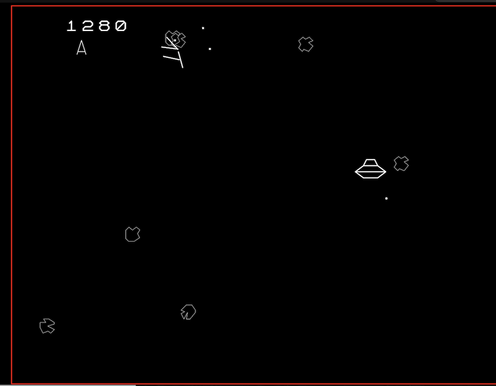
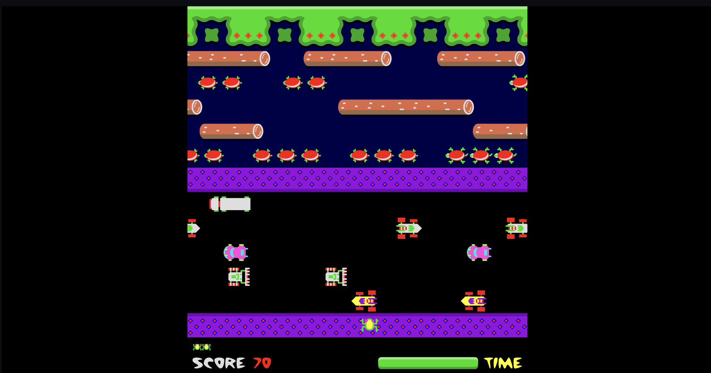
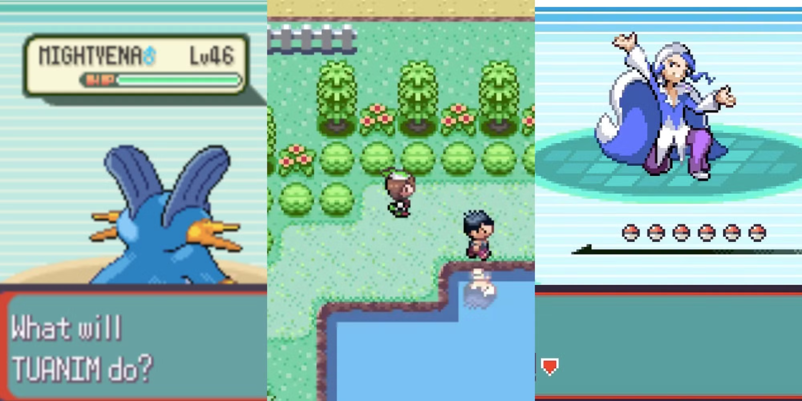
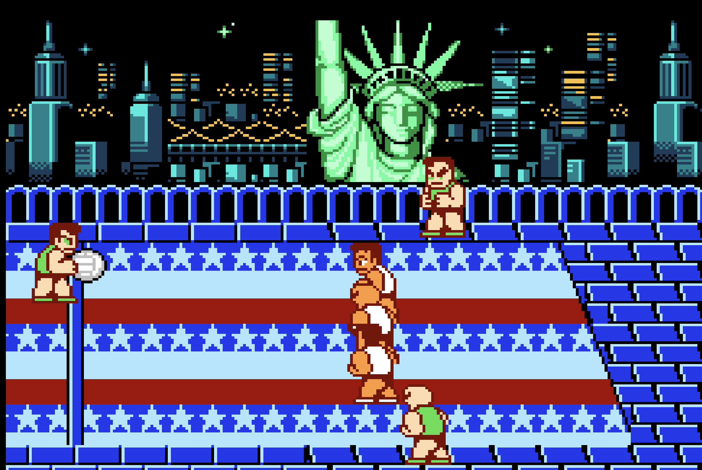
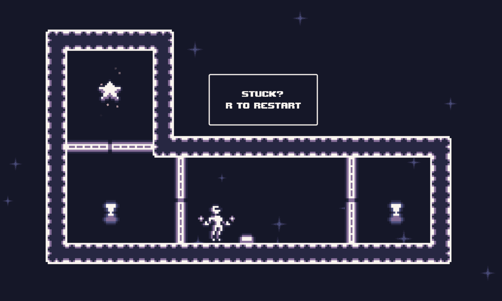
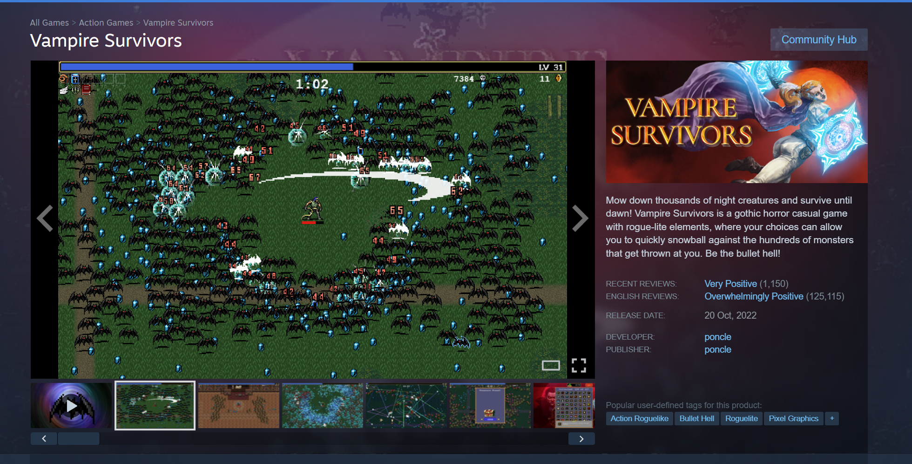

# Game Ideas and Mechanics Suggestions

A list of game ideas we have gathered along with any interesting design ideas or mechanics they bring that we will use to develop a design for our game.

### Tunic

Tunic is interesting because it uses an isometric grid system allowing it to present a 3D world using 2D graphics, creating a potential interesting technical design challenge. The scope of the game is too much to act as a base, but the isometric design could work as an adaptation on another game.

### Baba is You

Baba is you is a puzzle game about pushing blocks around to create new rules about how the game works. This is a great example I think of a game that has very simple rules, but has a lot of technical depth and complexity derived from those simple mechanics.

### FTL

FTL is a game where you control a ship and fight there various encounters managing your weapons, power, crew, shields and other things. This is a non-physics based option that is notable for its number of systems/crew the player must manage. FTL also has an easily understandable UI that we could learn from. Like Tunic, the depth of mechanics is too big to act as a base for a project, but its mechanics could serve as an inspiration

### Pong

Pong is probably one of the most simple games out there, which could allow it to serve as a good base to build upon. There are lots of ways you could add complexity to this game in interesting ways with its simple physics based simulation

### Plants vs Zombies

Plants vs Zombies is a 2D lane-based tower defense game. It takes a very simple technical base (objects moving on a grid) and layers it with charming art and perfect mathematical balancing.

### Dave the diver

Dave the diver is a casual single-player adventure RPG that successfully blends two distinct genres. The game features an addictive day-and-night cycle: 

-Day: You dive into the "Blue Hole" (a deep-sea environment that changes layout procedurally) to harpoon fish and gather resources. This is the Action/Roguelite phase.

-Night: You return to the surface to run a sushi restaurant. You choose the menu based on what you caught, pour tea, and serve customers. This is the Tycoon/Management phase.

 

### Asteroids
[Play here](https://www.echalk.co.uk/amusements/Games/asteroidsClassic/ateroids.html)

Asteroids is a simple game, but quite good in that we have a lot of freedom to experiment with the themes and components. We could take the main objective of the game and apply different rules, e.g. some asteroids(/whatever they may be) only need to be hit once, twice, etc., based on colour, for example. 

### Geometry Dash
[Play here](https://geometrylitepc.io)

The idea of an endless running game is interesting. The game is a matter of timing, where you have to press the screen/spacebar every time you encounter an obstacle. Not sure whether we could do the constant running aspect of it, but the main objective of jumping over obstacles to get around a map could be cool, also in a similar manner to FireBoy and Watergirl? As opposed to common shooter-type games.

### Frogger 
[Play here](https://www.crazygames.com/game/frogger)

The aim is to make sure 5 frogs cross the road with moving cars and jump over the lake containing moving planks to the lily pads. This could be interesting to adapt as a two-person game. We could also add a secondary objective of collecting coins to create competition with the other user. Also, the maps in Frogger are quite limited. They do increase in difficulty as they go on, but we could definitely experiment with extending the length of each map, as well as adding more complex obstacles. 

### Pokémon Emerald
[Play here](https://classicgamezone.com/games/pokemon-emerald)

A classic RPG focused on exploration, story progression, and turn-based battles.The mix of exploration and strategic combat makes it engaging without relying on fast-paced action. it does have a lot of dialogue sometimes.

### Super Dodge Ball
[Play here](https://classicgamezone.com/games/super-dodge-ball)

A fast-paced 2D sports game where two teams throw dodgeballs at each other to eliminate opponents. Players move, dodge, catch, and throw balls strategically to win matches. it can also be played by 2 players and we can also make a few changes to the gameplay like giving each player a single life so that the matches are smaller and interesting!

### Teleportorium
[Play here](https://devloglogan.itch.io/teleportorium)

A 2D platformer where the player navigates levels using a teleport ability to overcome obstacles and hazards. The focus is on timing and precise movement to reach the end of each level. The concept is so interesting!!

### Age of War
[Play here](https://ageofwargame.io/)

- Side-scrolling strategy game with two opposing bases
- Continuous unit deployment from both sides
- Era-based progression system spanning multiple historical periods
- Units and abilities unlocked through technological evolution
- Progression focused on form and unit type unlocks rather than pure stat upgrades
- Long-term strategic decisions significantly reshape battlefield dynamics

### Kingdom Guard

[Gameplay Video](https://www.youtube.com/watch?v=vJZjWYM9BIU)

- Lane-based tower defense with enemies advancing along a fixed path
- Focus on unit deployment rather than complex tower placement
- Strong emphasis on unit evolution and form upgrades
- Progression through unlocking stronger unit types instead of pure stat scaling
- Clear long-term growth driven by upgrade decisions
- Simple battlefield structure that highlights progression and evolution systems

### Feeding Frenzy 2

[Steam Page / Video](https://store.steampowered.com/app/3390/Feeding_Frenzy_2_Deluxe/)

- Growth-based arcade game focused on predator–prey dynamics
- Core mechanic centered on eating smaller fish while avoiding larger threats
- Progression driven by evolutionary unlocks rather than simple size scaling
- Players unlock new fish types with distinct appearances and abilities
- Clear sense of progression through form-based evolution
- Simple rule set that gradually expands the player’s role within the ecosystem

### Vampire Survivors

[Steam Page / Video](https://store.steampowered.com/app/1794680/Vampire_Survivors/)

- Action survival game with automatic attacks and minimal player input
- Core gameplay centered on surviving increasingly dense enemy waves
- Progression driven by weapon evolution rather than manual combat skill
- Weapons unlock new forms and attack patterns through upgrade paths
- Strong emphasis on form-based progression instead of pure stat increases
- Simple control scheme paired with deep progression and build variety

