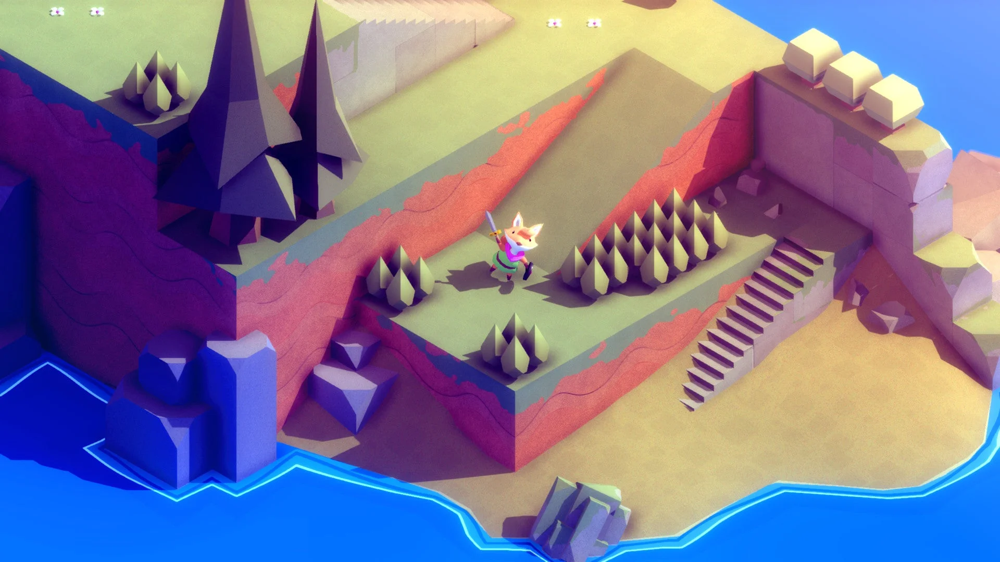
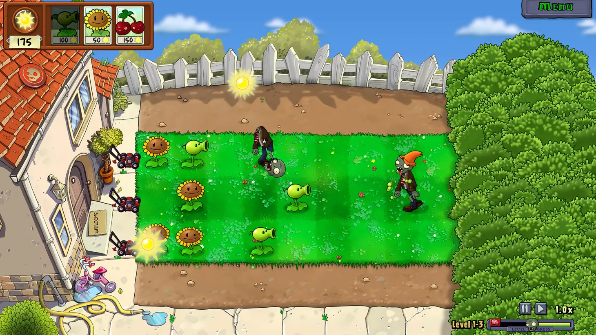

# Game Ideas and Mechanics Suggestions

A list of game ideas we have gathered along with any interesting design ideas or mechanics they bring that we will use to develop a design for our game.

### Tunic

Tunic is interesting because it uses an isometric grid system allowing it to present a 3D world using 2D graphics, creating a potential interesting technical design challenge. The scope of the game is too much to act as a base, but the isometric design could work as an adaptation on another game.

### Baba is You

Baba is you is a puzzle game about pushing blocks around to create new rules about how the game works. This is a great example I think of a game that has very simple rules, but has a lot of technical depth and complexity derived from those simple mechanics.

### FTL

FTL is a game where you control a ship and fight there various encounters managing your weapons, power, crew, shields and other things. This is a non-physics based option that is notable for its number of systems/crew the player must manage. FTL also has an easily understandable UI that we could learn from. Like Tunic, the depth of mechanics is too big to act as a base for a project, but its mechanics could serve as an inspiration

### Pong

Pong is probably one of the most simple games out there, which could allow it to serve as a good base to build upon. There are lots of ways you could add complexity to this game in interesting ways with its simple physics based simulation

### Plants vs Zombies

Plants vs Zombies is a 2D lane-based tower defense game. It takes a very simple technical base (objects moving on a grid) and layers it with charming art and perfect mathematical balancing.

### Dave the diver

Dave the diver is a casual single-player adventure RPG that successfully blends two distinct genres. The game features an addictive day-and-night cycle: 

-Day: You dive into the "Blue Hole" (a deep-sea environment that changes layout procedurally) to harpoon fish and gather resources. This is the Action/Roguelite phase.

-Night: You return to the surface to run a sushi restaurant. You choose the menu based on what you caught, pour tea, and serve customers. This is the Tycoon/Management phase.

 

